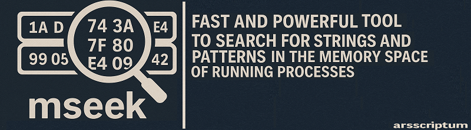

<p align="center">
  
</p>


# mseek - process scanner / memory search tool for strings and regular expressions

A fast and powerful tool to search for strings and patterns in the memory space of running processes on a 64-bit/32bits Windows system.

In the example below, you see it was used to crack the F-Secure Freedome VPN client

---

### 🛠 How to Build - Information

```
./Build.bat 
```

Or

Visual Studio 2019


### Version generation

Avoid version files generation to mess your commits:

```bash
git update-index --assume-unchanged src/version.cpp
git update-index --assume-unchanged build.nfo
```


## 📦 Usage

```
mseek.exe <-s string> <-p PID | -n PROCESSNAME | -i FILE> [options]
```

### 🔧 Required Arguments:
- `-s <string>` : String to search for
- `-p <PID>` : Target a specific process by its ID  
  **or**  
- `-n <PROCESSNAME>` : Target a process by its name  
  **or**  
- `-i <file>` : Read multiple search strings from a file (one per line)

---

### 🧩 Options


---

## 💡 Examples

1. Search for a string in a specific process using process name <sup>[1](#ref1)</sup>

```sh
mseek.exe -n fsvpnservice_64.exe -s "<key>" 
```
2. Search for a string in a specific process using process id <sup>[2](#ref1)</sup>

```sh
mseek.exe -pid 2476 -s "<key>" 
```

3. Search for a string, print 200 bytes **after** found instance <sup>[3](#ref2)</sup>
```Get the address: 0x0000027B10F5E70E```
```sh
mseek.exe -n fsvpnservice_64.exe -s "<key>" -x -a 200
```
4. Search for a string, print 100 bytes **before** found instance <sup>[4](#ref3)</sup>
```Get the address: 0x0000027B10F5EDE4```
```sh
mseek.exe -n fsvpnservice_64.exe -s "<key>" -x -b 100
```
5. Get Delta Memory using addresses <sup>[5](#ref4)</sup>

Diff the address: ```0x0000027B10F5EDE4 - 0x0000027B10F5E70E = 1750```

6. Search for a string, print 1750 bytes **after** found instance, output in file, **printable charcaters only** <sup>[6](#ref5)</sup>

--------------------------------

## 💡 REGEX patterns

The example below will look for all GUIDS with this REGEX pattern<sup>[7](#ref6)</sup> : ```"\{[0-9A-Fa-f]{8}-[0-9A-Fa-f]{4}-[0-9A-Fa-f]{4}-[0-9A-Fa-f]{4}-[0-9A-Fa-f]{12}\}"```


1. Search for a **REGEX PATTERN**, in **PRIVATE** memory, output in file, **printable charcaters only** <sup>[7](#ref6)</sup>


```
mseek.exe -n fsvpnservice_64.exe -s "\{[0-9A-Fa-f]{8}-[0-9A-Fa-f]{4}-[0-9A-Fa-f]{4}-[0-9A-Fa-f]{4}-[0-9A-Fa-f]{12}\}" -t private -r -o "d:\mem.txt" -x -z
```


--------------------------------

### 32bit Version Build in Win32 Configuration


### NOTE 

IF NOT RUNNNIG AS ADMIN, Some Process Are Not Accessible! If you cannot read a process memory, open a shell as administrator!

#### Auto-Elevate Privilege

You can use ```-e``` to auto -elevate privileges (not fully supported, best you run directly in admin mode). If detected, auto elevate will sleep on exit, because a new window is opened and you want to read the results.


--------------------------------


## 📝 License

This software is provided as-is for educational and forensic analysis purposes. Use responsibly.

--------------------------------

<p align="center">
  
</p>


> Created by [Guillaume Plante](guillaumeplante.qc@gmail.com)
<br>
<br>

[mseek](https://github.com/arsscriptum/mseek) has been helping developers and analysts dig into memory since 2022.


--------------------------------

<a id="ref1"></a> [1] 


-------------------------------

<a id="ref2"></a>[2] 


-------------------------------

<a id="ref2"></a>[3] 


-------------------------------

<a id="ref3"></a>[4] 


-------------------------------

<a id="ref4"></a>[5] 


-------------------------------


<a id="ref5"></a>[6] 


-------------------------------

<a id="ref6"></a>[7] 
<a href="img/regex.gif" target="_blank">
  
</a>
